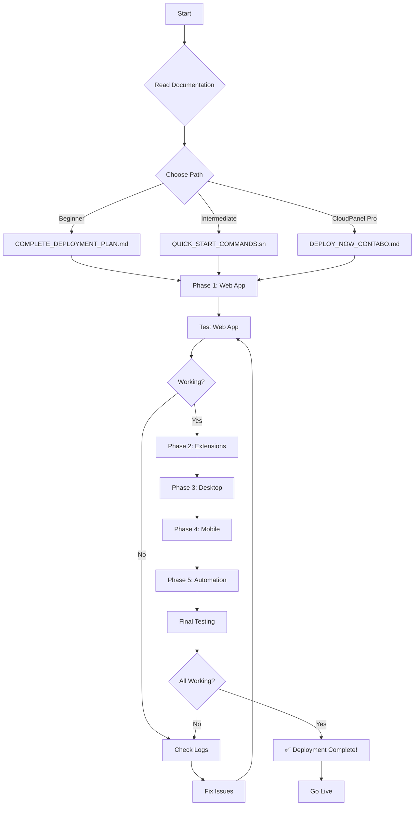

# 📘 Working Tracker - Master Deployment Index

**Last Updated:** January 2, 2026
**Platform:** Contabo VPS + CloudPanel + Ubuntu
**GitHub SSH:** ✅ Configured (SHA256:MI52rYLKv7OJZxvWOU43Ri++ShOv89rCz0Y0JhFTx6c)

---

## 🎯 START HERE

**Never deployed before?** → Read this page, then open `START_DEPLOYMENT_HERE.md`

**Experienced deployer?** → Jump to `QUICK_START_COMMANDS.sh`

**Want to understand everything?** → Read `COMPLETE_DEPLOYMENT_PLAN.md`

---

## 📚 Documentation Structure

```
MASTER_DEPLOYMENT_INDEX.md ← YOU ARE HERE (Overview of everything)
│
├── START_DEPLOYMENT_HERE.md (Entry point for deployment)
│   │
│   ├── DEPLOYMENT_SUMMARY.md (Quick reference card)
│   │
│   ├── COMPLETE_DEPLOYMENT_PLAN.md (Full step-by-step guide)
│   │   └── Sections:
│   │       ├── Part 1: Web Application (Backend + Frontend)
│   │       ├── Part 2: Browser Extensions
│   │       ├── Part 3: Desktop Apps
│   │       ├── Part 4: Mobile Apps
│   │       ├── Part 5: Automation & CI/CD
│   │       └── Part 6: Monitoring & Maintenance
│   │
│   ├── DEPLOYMENT_CHECKLIST.md (Track your progress)
│   │
│   └── QUICK_START_COMMANDS.sh (Automated deployment script)
│
├── DEPLOY_NOW_CONTABO.md (Alternative CloudPanel guide)
│
├── APPS_AND_EXTENSIONS_GUIDE.md (Deep dive on apps/extensions)
│
└── README.md (Project overview)
```

---

## 🚦 Choose Your Deployment Path

### 🟢 Path 1: First-Time Deployer (RECOMMENDED)
**Time:** 5-6 hours | **Difficulty:** Beginner

1. **Read** (30 min total):
   - `START_DEPLOYMENT_HERE.md` (10 min)
   - `DEPLOYMENT_SUMMARY.md` (10 min)
   - Skim `COMPLETE_DEPLOYMENT_PLAN.md` (10 min)

2. **Prepare** (30 min):
   - Gather all credentials
   - Verify VPS access
   - Configure GitHub SSH
   - Print checklist

3. **Deploy** (3-4 hours):
   - Follow `COMPLETE_DEPLOYMENT_PLAN.md`
   - Check off items in `DEPLOYMENT_CHECKLIST.md`
   - Test after each phase

4. **Verify** (30-60 min):
   - Run all tests
   - Fix any issues
   - Document problems

**Best For:** Learning, understanding, catching issues early

---

### 🟡 Path 2: Experienced Deployer
**Time:** 2-3 hours | **Difficulty:** Intermediate

1. **Read** (15 min):
   - `DEPLOYMENT_SUMMARY.md`
   - Review `DEPLOYMENT_CHECKLIST.md`

2. **Configure** (15 min):
   - Edit `QUICK_START_COMMANDS.sh`
   - Update all variables

3. **Deploy** (60-90 min):
   - Run `QUICK_START_COMMANDS.sh`
   - Monitor for errors
   - Manual steps for desktop/mobile

4. **Verify** (15-30 min):
   - Test all features
   - Check logs

**Best For:** Speed, automation, experience with similar deployments

---

### 🔵 Path 3: CloudPanel Expert
**Time:** 3-4 hours | **Difficulty:** Intermediate

1. **Read** (15 min):
   - `DEPLOY_NOW_CONTABO.md`

2. **Deploy** (2-3 hours):
   - Follow CloudPanel-specific guide
   - Use CloudPanel features

3. **Verify** (30 min):
   - Test everything

**Best For:** CloudPanel users, VPS management experience

---

## 📦 What Gets Deployed

### Core System (REQUIRED)
| Component | Time | Files | Status |
|-----------|------|-------|--------|
| Backend API | 30 min | Python/FastAPI | ✅ Ready |
| Frontend Web | 30 min | React | ✅ Ready |
| Database | 0 min | Supabase | ✅ Configured |
| SSL/HTTPS | 10 min | Let's Encrypt | ✅ Auto |
| Nginx Config | 10 min | Proxy/routing | ✅ Ready |

**Result:** Working web app with payments (Stripe integrated)

---

### Extensions & Apps (OPTIONAL)
| Component | Time | Platform | Build Location |
|-----------|------|----------|----------------|
| Chrome Extension | 10 min | Any | VPS |
| Firefox Extension | 10 min | Any | VPS |
| Edge Extension | 10 min | Any | VPS |
| Desktop Linux | 30 min | Linux | VPS |
| Desktop Windows | 30 min | Windows | Windows PC |
| Desktop Mac | 30 min | macOS | Mac |
| Mobile Android | 60 min | Android | Any |
| Mobile iOS | 60 min | iOS | Mac only |

**Result:** Downloadable apps for all platforms

---

### Automation (RECOMMENDED)
| Component | Time | Purpose | Frequency |
|-----------|------|---------|-----------|
| Auto-update | 10 min | Pull from GitHub | Manual trigger |
| Health checks | 10 min | Monitor services | Every 5 minutes |
| Backups | 10 min | Backup files | Daily at 2 AM |
| Log rotation | 5 min | Manage logs | Daily |

**Result:** Self-maintaining system

---

## 🔑 Required Before Starting

### VPS Access ✅
```bash
# Test SSH
ssh root@your-vps-ip

# Verify CloudPanel
https://your-vps-ip:8443

# Check GitHub SSH
ssh -T git@github.com
```

### Credentials Needed 📝

**Supabase (Database):**
- [ ] Project URL: `https://xxxxx.supabase.co`
- [ ] Anon Key: `eyJhbGci...`
- [ ] Service Role Key: `eyJhbGci...`
- [ ] Database URL: `postgresql://...`

**Stripe (Payments - Already Integrated):**
- [ ] Secret Key: `sk_live_...` or `sk_test_...`
- [ ] Publishable Key: `pk_live_...` or `pk_test_...`
- [ ] Webhook Secret: `whsec_...`

**Domain Configuration:**
- [ ] Domain name: `worktracker.yourdomain.com`
- [ ] DNS pointed to VPS IP
- [ ] SSL certificate ready (auto via CloudPanel)

**Security:**
- [ ] JWT Secret (generate: `openssl rand -hex 32`)

### Time Commitment 🕐

**Minimum Deployment (Web App Only):**
- 2 hours total
- Can be production-ready
- Payments working

**Full Deployment (Everything):**
- 5-6 hours total
- All platforms
- All features

**Maintenance:**
- 15 minutes/week (automated)
- 30 minutes/month (updates)

---

## 📁 Repository Structure

```
working-tracker/
├── backend/                     # Python FastAPI Backend
│   ├── server.py               # Main application
│   ├── db.py                   # Database connection
│   ├── requirements.txt        # Python dependencies (httpx==0.28.1 ✅)
│   ├── routes/                 # API endpoints
│   │   ├── payments.py         # Stripe integration
│   │   ├── pricing.py          # Subscription tiers
│   │   └── ... (45+ routes)
│   └── utils/                  # Helper functions
│
├── frontend/                    # React Frontend
│   ├── src/
│   │   ├── pages/              # Application pages
│   │   ├── components/         # React components
│   │   └── lib/api.js          # API client
│   ├── package.json            # Node dependencies
│   └── build/                  # Production build (after deployment)
│
├── browser-extensions/          # Browser Extensions
│   ├── chrome/                 # Chrome extension
│   ├── firefox/                # Firefox extension
│   ├── edge/                   # Edge extension
│   └── config.example.js       # Configuration template
│
├── desktop-tracker/            # Electron Desktop App
│   ├── main.js                 # Electron main process
│   ├── package.json            # Electron dependencies
│   └── assets/                 # App icons
│
├── mobile-app/                 # React Native Mobile App
│   ├── App.js                  # Main app component
│   ├── android/                # Android build config
│   └── ios/                    # iOS build config
│
├── deploy/                     # Deployment files
│   ├── docker/                 # Docker configs (optional)
│   ├── nginx/                  # Nginx configs
│   ├── scripts/                # Deployment scripts
│   └── sql/                    # Database schemas
│
├── supabase/                   # Supabase migrations
│   └── migrations/             # Database migrations
│
├── tests/                      # Test files
│   └── *.py                    # Python tests
│
└── Documentation Files:
    ├── MASTER_DEPLOYMENT_INDEX.md      ← YOU ARE HERE
    ├── START_DEPLOYMENT_HERE.md        ← Start here
    ├── DEPLOYMENT_SUMMARY.md           ← Quick reference
    ├── COMPLETE_DEPLOYMENT_PLAN.md     ← Full guide
    ├── DEPLOYMENT_CHECKLIST.md         ← Progress tracking
    ├── QUICK_START_COMMANDS.sh         ← Automated script
    ├── DEPLOY_NOW_CONTABO.md           ← CloudPanel guide
    ├── APPS_AND_EXTENSIONS_GUIDE.md    ← Apps deep dive
    └── README.md                        ← Project overview
```

---

## 🎯 Quick Decision Guide

**Choose based on your situation:**

### "I've never deployed a web app before"
→ Read: `START_DEPLOYMENT_HERE.md`
→ Follow: `COMPLETE_DEPLOYMENT_PLAN.md`
→ Use: `DEPLOYMENT_CHECKLIST.md`
→ Time: 5-6 hours

### "I've deployed apps but not on CloudPanel"
→ Read: `DEPLOYMENT_SUMMARY.md`
→ Follow: `DEPLOY_NOW_CONTABO.md`
→ Time: 3-4 hours

### "I want to automate as much as possible"
→ Read: `DEPLOYMENT_SUMMARY.md`
→ Configure: `QUICK_START_COMMANDS.sh`
→ Run: `./QUICK_START_COMMANDS.sh`
→ Time: 2-3 hours

### "I only need the web app, not mobile/desktop"
→ Follow: `COMPLETE_DEPLOYMENT_PLAN.md` Part 1 only
→ Time: 1-2 hours

### "I want to understand the architecture first"
→ Read: `README.md`
→ Read: `COMPLETE_PROJECT_SUMMARY.md`
→ Then: Choose deployment method

---

## ✅ Pre-Flight Checklist

**Before you start ANY deployment:**

**Access:**
- [ ] Can SSH into VPS: `ssh root@vps-ip`
- [ ] Can access CloudPanel: `https://vps-ip:8443`
- [ ] GitHub SSH works: `ssh -T git@github.com`

**Credentials:**
- [ ] Have Supabase URL and keys
- [ ] Have Stripe keys (required - already integrated)
- [ ] Generated JWT secret
- [ ] Domain name ready

**Infrastructure:**
- [ ] VPS has 2GB+ RAM
- [ ] VPS has 20GB+ disk space
- [ ] DNS configured (or ready to configure)
- [ ] Ports 80, 443, 22 open

**Software:**
- [ ] Python 3.11 (will be installed)
- [ ] Node.js 20 (will be installed)
- [ ] Nginx (CloudPanel provides)
- [ ] Git (should be installed)

**Time:**
- [ ] Have 3-6 hours available
- [ ] Can focus without interruptions
- [ ] Have backup plan if issues

**Knowledge:**
- [ ] Read this index
- [ ] Understand what will be deployed
- [ ] Know which path to follow
- [ ] Know where to get help

---

## 🚀 Deployment Flow



---

## 📊 Success Criteria

**Minimum Viable Deployment (Web App Only):**
- [ ] Website loads at your domain
- [ ] Can create account
- [ ] Can login
- [ ] Time tracking works
- [ ] Stripe payments work
- [ ] SSL certificate valid
- [ ] No console errors

**Full Deployment (Everything):**
- [ ] All above criteria
- [ ] Browser extensions downloadable
- [ ] Desktop apps downloadable
- [ ] Mobile apps downloadable
- [ ] Health checks running
- [ ] Backups automated
- [ ] Monitoring configured

---

## 🆘 If You Get Stuck

### 1. Check Documentation
- Search this index
- Review specific guide
- Check troubleshooting section

### 2. Check Logs
```bash
# Backend logs
journalctl -u worktracker-backend -f

# Nginx logs
tail -f /var/log/nginx/error.log

# System logs
dmesg | tail
```

### 3. Common Issues

| Problem | Quick Fix |
|---------|-----------|
| Backend won't start | Check `.env.production` file |
| 502 error | Verify backend is running |
| Database error | Check Supabase credentials |
| SSL error | Wait for Let's Encrypt (5-10 min) |
| Extensions not working | Check API_URL in config.js |

### 4. Get Help
1. Re-read relevant documentation
2. Check GitHub issues
3. Search error messages
4. Ask in community forums

---

## 🎓 Learning Path

**If you want to learn while deploying:**

1. **Day 1: Understanding (2 hours)**
   - Read `README.md`
   - Read `COMPLETE_PROJECT_SUMMARY.md`
   - Read `START_DEPLOYMENT_HERE.md`
   - Understand architecture

2. **Day 2: Deploy Web App (3 hours)**
   - Follow `COMPLETE_DEPLOYMENT_PLAN.md` Part 1
   - Take notes
   - Test thoroughly
   - Document issues

3. **Day 3: Deploy Extensions (2 hours)**
   - Follow Part 2 of deployment guide
   - Test on multiple browsers
   - Fix any issues

4. **Day 4: Deploy Apps (3 hours)**
   - Build desktop apps
   - Build mobile apps
   - Test on devices

5. **Day 5: Automation (2 hours)**
   - Setup scripts
   - Configure monitoring
   - Test automation

6. **Day 6: Polish (2 hours)**
   - Final testing
   - Documentation
   - Optimization

**Total:** ~14 hours for deep understanding

---

## 🏆 Deployment Milestones

**Milestone 1: Backend Running**
- Backend service active
- Database connected
- API responding

**Milestone 2: Frontend Built**
- React app built
- Served by Nginx
- Connects to backend

**Milestone 3: Web App Live**
- Domain resolves
- SSL working
- Can login

**Milestone 4: Payments Working**
- Stripe connected
- Can process payments
- Webhooks configured

**Milestone 5: Extensions Ready**
- Extensions packaged
- Hosted for download
- Connect to backend

**Milestone 6: Automation Active**
- Health checks running
- Backups automated
- Self-maintaining

**Final: Production Ready**
- All features working
- All tests passing
- Monitoring active
- Documentation complete

---

## 📅 Recommended Timeline

### Conservative Timeline (Learning)
- **Week 1:** Read documentation, prepare
- **Week 2:** Deploy web application
- **Week 3:** Deploy extensions and desktop
- **Week 4:** Deploy mobile and automation

### Standard Timeline (Experienced)
- **Day 1:** Web application
- **Day 2:** Extensions
- **Day 3:** Desktop apps
- **Day 4:** Mobile apps
- **Day 5:** Automation and testing

### Fast Timeline (Expert)
- **Day 1 Morning:** Web application
- **Day 1 Afternoon:** Extensions
- **Day 2 Morning:** Desktop apps
- **Day 2 Afternoon:** Automation

---

## 🎯 Next Steps

**Right Now:**

1. **Bookmark this page** - Your central reference
2. **Open** `START_DEPLOYMENT_HERE.md`
3. **Read** `DEPLOYMENT_SUMMARY.md`
4. **Choose** your deployment path
5. **Begin** deployment!

**After Deployment:**

1. Test all features thoroughly
2. Set up monitoring and alerts
3. Create user documentation
4. Plan marketing strategy
5. Launch to users

---

## 📞 Support Resources

| Resource | Use For | Link/Command |
|----------|---------|--------------|
| This Index | Overview, navigation | `MASTER_DEPLOYMENT_INDEX.md` |
| Start Guide | Getting started | `START_DEPLOYMENT_HERE.md` |
| Full Guide | Step-by-step deployment | `COMPLETE_DEPLOYMENT_PLAN.md` |
| Checklist | Progress tracking | `DEPLOYMENT_CHECKLIST.md` |
| Quick Script | Fast deployment | `QUICK_START_COMMANDS.sh` |
| Project README | Project overview | `README.md` |
| Logs | Debugging | `journalctl -u worktracker-backend -f` |

---

## ✅ You're Ready!

**You have:**
- [x] Contabo VPS with CloudPanel
- [x] GitHub SSH configured
- [x] Comprehensive documentation
- [x] Multiple deployment options
- [x] Troubleshooting guides
- [x] Support resources

**Now:**
→ **Open `START_DEPLOYMENT_HERE.md` and begin!** 🚀

---

**Good luck with your deployment! You've got this!** 💪

---

_Last Updated: January 2, 2026_
_Working Tracker v1.0.0_
_All systems ready for deployment ✅_
